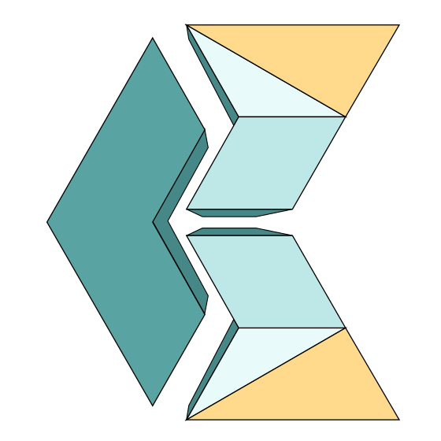

## Front-end developer

This repo was born when I ran into the GitHub Skills interactive courses. It grabbed my curiosity and off I went.
I will make sure to keep the momentum, carry on learning, growing, and pushing my limits.

## Socials :handshake:

Quick links to my digital platforms.

 <a href="https://www.linkedin.com/in/carlos-e-alford/" target="_blank">Linkedin</a>: For a formal approach, come and connect with me over at Linkedin.

 <a href="https://github.com/webshuriken" target="_blank">GitHub webshuriken</a>: Come checkout my bigger projects, have a look at my repositories, clone, fork or lets collaborate.

 <a href="https://carlosealford.com" target="_blank">Portfolio</a>: You want to see something cool? then I think you will like my portfolio. It was fun to create.

 <a href="https://twitter.com/webshuriken" target="_blank">Twitter X</a>: You can also reach me through twitter ( X ). The new name still doesn't feel right but I'm there.

### Under construction :hammer:

These sites are being build. They will go live by the end of July 2024

 <a href="https://carlosealford.com" target="_blank">Repo  Blog</a>: A small blog about my learning journey. It's all the highlights of my experience including mistakes.

 <a href="https://dev.to/webshuriken" target="_blank">Dev Blog</a>: This is all about technologies I have worked with, whether it was a solo project or group one. I want to share what I have learned along the way.

## My GitHub stats :bar_chart:

